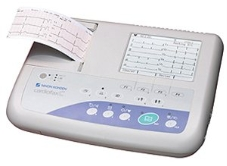
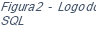
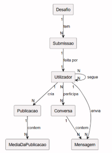
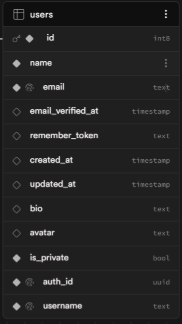



Curso com Plano Próprio

Informática e Tecnologias Multimédia

Prova de aptidão profissional

12\.º ano de escolaridade

Relatório

Seara

Aluno

Daniel Alexandre Marques da Silva

Trabalho realizado sob a orientação do professor

Nuno Queirós Rodrigues

Vila Nova de Gaia, julho de 0000

|MOD274.4|![Uma imagem com texto, Tipo de letra, Gráficos, logótipo

Descrição gerada automaticamente]|![Uma imagem com Tipo de letra, Gráficos, logótipo, design gráfico

Descrição gerada automaticamente]|![ref1]|
| - | - | - | - |

Relatório da prova de aptidão profissional

Dedicatória

Lorem ipsum dolor sit amet, consectetuer adipiscing elit.

Maecenas porttitor congue massa.

— Apagar —

Pode ser um texto, ou apenas uma simples frase que mencione um ente ou uma entidade.

Não é obrigatório inserir.

xv

|MOD274.4|![Uma imagem com texto, Tipo de letra, Gráficos, logótipo

Descrição gerada automaticamente]|![Uma imagem com Tipo de letra, Gráficos, logótipo, design gráfico

Descrição gerada automaticamente]|![ref1]|
| - | - | - | - |

# **Agradecimentos**
Lorem ipsum dolor sit amet, consectetuer adipiscing elit. Maecenas porttitor congue massa. Fusce posuere, magna sed pulvinar ultricies, purus lectus malesuada libero, sit amet commodo magna eros quis urna. Nunc viverra imperdiet enim. Fusce est. Vivamus a tellus. Pellentesque habitant morbi tristique senectus et netus et malesuada fames ac turpis egestas. Proin pharetra nonummy pede. Mauris et orci. Aenean nec lorem.

Donec ut est in lectus consequat consequat. Etiam eget dui. Aliquam erat volutpat. Sed at lorem in nunc por-ta tristique. Proin nec augue. Quisque aliquam tempor magna. Pellentesque habitant morbi tristique senectus et netus et malesuada fames ac turpis egestas. Nunc ac magna. Maecenas odio dolor, vulputate vel, auctor ac, accumsan id, felis. Pellentesque cursus sagittis felis.

— Apagar —

Destina-se a referir pessoas ou entidades cuja colaboração tenha sido pertinente para a realização do trabalho.

Não é obrigatório inserir.

# **Resumo**
Lorem ipsum dolor sit amet, consectetuer adipiscing elit. Maecenas porttitor congue massa. Fusce posuere, magna sed pulvinar ultricies, purus lectus malesuada libero, sit amet commodo magna eros quis urna. Nunc viverra imperdiet enim. Fusce est. Vivamus a tellus. Pellentesque habitant morbi tristique senectus et netus et malesuada fames ac turpis egestas. Proin pharetra nonummy pede. Mauris et orci. Aenean nec lorem.

Donec ut est in lectus consequat consequat. Etiam eget dui. Aliquam erat volutpat. Sed at lorem in nunc por-ta tristique. Proin nec augue. Quisque aliquam tempor magna. Pellentesque habitant morbi tristique senectus et netus et malesuada fames ac turpis egestas. Nunc ac magna. Maecenas odio dolor, vulputate vel, auctor ac, accumsan id, felis. Pellentesque cursus sagittis felis.

Palavras-chave: …

— Apagar —

Apresenta de um modo sucinto, claro e objetivo, as questões ou as informações mais importantes tratadas no trabalho como o tema, os objetivos que se pretendem alcançar, os métodos usados e os resultados obtidos.

Recomendações:

- Utilizar 200 palavras no máximo.
- Escrever três a cinco palavras-chave.
- Não usar abreviaturas.
- Não usar tabelas ou figuras.
- Não usar referências bibliográficas.
- Não fazer referência a tabelas ou figuras no texto.

Exemplo de frases tipo a usar no resumo:

«O presente estudo tem como objetivo principal caracterizar…»

«Os dados foram recolhidos através de um questionário de resposta fechada com um total de n questões para avaliação de aspetos relativos a: …» [incluir secções do questionário]

«No contexto do trabalho a que se refere este estudo foi analisada a questão…»

«Realizou-se uma análise descritiva dos resultados, tendo-se concluído que…»]

# **Abstract**
Lorem ipsum dolor sit amet, consectetuer adipiscing elit. Maecenas porttitor congue massa. Fusce posuere, magna sed pulvinar ultricies, purus lectus malesuada libero, sit amet commodo magna eros quis urna. Nunc viverra imperdiet enim. Fusce est. Vivamus a tellus. Pellentesque habitant morbi tristique senectus et netus et malesuada fames ac turpis egestas. Proin pharetra nonummy pede. Mauris et orci. Aenean nec lorem.

Donec ut est in lectus consequat consequat. Etiam eget dui. Aliquam erat volutpat. Sed at lorem in nunc por-ta tristique. Proin nec augue. Quisque aliquam tempor magna. Pellentesque habitant morbi tristique senectus et netus et malesuada fames ac turpis egestas. Nunc ac magna. Maecenas odio dolor, vulputate vel, auctor ac, accumsan id, felis. Pellentesque cursus sagittis felis.

Keywords: …

Índice geral

[Agradecimentos	v](#_toc228179505)

[Resumo	vii](#_toc228179506)

[Abstract	ix](#_toc228179507)

[Lista de abreviaturas	15](#_toc228179508)

[1) Introdução	17](#_toc228179509)

[2) Colégio de Gaia	18](#_toc228179510)

[2.1) História do Colégio	18](#_toc228179511)

[2.2) Instalações do Colégio	19](#_toc228179512)

[2.3) Níveis de Ensino	19](#_toc228179513)

[2.3.1) Pré-Escolar	19](#_toc228179514)

[2.3.2) Básico	19](#_toc228179515)

[2.3.3) Secundário	19](#_toc228179516)

[2.4) Cursos do Secundário	20](#_toc228179517)

[3) Curso de ITM	21](#_toc228179518)

[3.1) Descrição do Curso	21](#_toc228179519)

[3.2) Plano de Estudo	22](#_toc228179520)

[3.3) PAP e FCT	24](#_toc228179521)

[3.4) Prosseguimento de estudos	24](#_toc228179522)

[3.5) Saídas profissionais	24](#_toc228179523)

[3.6) Mercado de Trabalho	24](#_toc228179524)

[4) Descrição do projeto	25](#_toc228179525)

[4.1) Módulos da App	25](#_toc228179526)

[4.1.1) Módulo das conversas	25](#_toc228179527)

[4.1.2) Módulo das publicações	25](#_toc228179528)

[4.1.3) Módulo do perfil	25](#_toc228179529)

[4.2) Estudo do mercado	26](#_toc228179530)

[4.2.1) Instagram	26](#_toc228179531)

[4.2.2) Tiktok	26](#_toc228179532)

[4.3) Ferramentas utilizadas	27](#_toc228179533)

[4.3.1) Linguagem de Consulta	27](#_toc228179534)

[4.3.2) Sistema Gestor de Bases de Dados	27](#_toc228179535)

[4.3.3) Backend como Serviço	27](#_toc228179536)

[4.3.4) Linguagem de programação do back-end	28](#_toc228179537)

[4.3.5) Framework utilizada no backend	28](#_toc228179538)

[4.3.6) Linguagem de programação do frontend	29](#_toc228179539)

[4.3.7) Framework utilizada no frontend	29](#_toc228179540)

[4.3.8) Editor de código	30](#_toc228179541)

[4.3.9) Controlo de versões	30](#_toc228179542)

[4.4) Modelação da base de dados	31](#_toc228179543)

[4.4.1) Entidades do Sistema e Relações Principais	31](#_toc228179544)

[4.4.2) Modelo Lógico	31](#_toc228179545)

[4.4.3) Modelo Físico	34](#_toc228179546)

[4.5) Funcionalidades principais (atualmente)	35](#_toc228179547)

[4.5.1) Sessão	35](#_toc228179548)

[4.5.2) Mensagens	35](#_toc228179549)

[4.5.3) Perfil	37](#_toc228179550)

[5) Conclusão	39](#_toc228179551)

[6) Referências bibliográficas	40](#_toc228179552)

[7) Glossário	41](#_toc228179553)

[8) Apêndices/Anexos	43](#_toc228179554)

— Apagar —

Refere-se à numeração das divisões do trabalho pela ordem em que são apresentadas, com a respetiva indicação da página em que começa essa parte do trabalho.

Índice de Tabelas

[Tabela 1. As várias gerações de evolução da tecnologia	16](#_toc182492185)

Índice de Gráficos

Índice de Figuras

Figura 1. Exemplo de um eletrocardiógrafo	[16](#_toc182492186)

# **Lista de abreviaturas**
— Apagar —

Esta secção consiste na relação alfabética das abreviaturas, das siglas e dos símbolos utilizados no texto, seguidos das palavras ou das expressões correspondentes, expressas por extenso. Só faz sentido efetuar listas de siglas e símbolos quando o número de cada um destes elementos for significativo em todo o trabalho.

A sigla é sempre descodificada a primeira vez que surge, colocando-se entre parênteses ou a sigla ou a expressão por extenso. A sigla deve ser evitada nos títulos e não é usada no resumo.

Exemplos:

AGD	Animação e Gestão Desportiva

AM	Administração e Marketing

AQB	Análises Químico-Biológicas

CGE	Contabilidade e Gestão Empresarial

CM	Comunicação Multimédia

DP-AE	Desenhador de Projetos – Arquitetura e Engenharia

EIA	Eletrónica Industrial e Automação

ETC	Eletrónica, Telecomunicações e Computadores

FCT	Formação em contexto de trabalho

ITM	Informática e Tecnologias Multimédia

MDI	Mecânica e Design Industrial

PAA	Plano anual de atividades

PAP	Prova de aptidão profissional

PE	Projeto educativo

RI	Regulamento interno

TdS	Tecnologias da Saúde

TSA	Tecnologias e Segurança Alimentar

TSI	Tecnologias e Sistemas de Informação

1) # **Introdução**
   Lorem ipsum dolor sit amet, consectetuer adipiscing elit. Maecenas porttitor congue massa. Fusce posuere, magna sed pulvinar ultricies, purus lectus malesuada libero, sit amet commodo magna eros quis urna. Nunc viverra imperdiet enim. Fusce est. Vivamus a tellus. Pellentesque habitant morbi tristique senectus et netus et malesuada fames ac turpis egestas. Proin pharetra nonummy pede. Mauris et orci. Aenean nec lorem.

   Donec ut est in lectus consequat consequat. Etiam eget dui. Aliquam erat volutpat. Sed at lorem in nunc por-ta tristique. Proin nec augue. Quisque aliquam tempor magna. Pellentesque habitant morbi tristique senectus et netus et malesuada fames ac turpis egestas. Nunc ac magna. Maecenas odio dolor, vulputate vel, auctor ac, accumsan id, felis. Pellentesque cursus sagittis felis.

   — Apagar —

- Tem por finalidade apresentar o tema, o enquadramento, a delimitação e a justificação da temática, as abordagens escolhidas, os objetivos, a metodologia utilizada e a estrutura do trabalho.
- Apresentação das razões para se tratar este tema e não outro.
- Enquadramento da problemática.
- Geralmente esta parte é a última a ser redigida.

Exemplos de frases tipo a usar na introdução:

«Neste trabalho, pretende dar-se conta de uma investigação/estudo que se enquadra na prova de aptidão profissional, do curso de …. Este trabalho, centrado no campo de pesquisa …, procura contribuir para uma compreensão mais aprofundada sobre os processos de …»

«Através da realização do presente trabalho pretende-se:

- caracterizar …;
- identificar as principais razões para …;
- comparar as expetativas …;
- apontar os fatores …;
- recolher sugestões sobre …;
- identificar …»

«Na primeira parte do documento enunciaremos os principais conceitos inerentes ao estudo e as principais referências na área. Na segunda parte do trabalho explicitaremos, de modo sucinto, a metodologia adotada, bem como os seus principais resultados. Na terceira parte passaremos à análise e à discussão dos dados obtidos. Por fim, serão apresentadas as conclusões do estudo, assim como as principais referências bibliográficas».

1) # **Colégio de Gaia**
   1) ## **História do Colégio**
      Em 1933, na “Quinta do Trancoso”, nasceu o Colégio Externato de Gaia por iniciativa do então Bispo do Porto em Mafamude, Vila Nova de Gaia. Nas décadas de 1960 e 1970 assistiu-se a uma significativa expansão das instalações, transformando o Colégio de Gaia no maior Colégio do país ao nível de instalações escolares e desportivas e de espaços exteriores, situação esta que se mantém até aos dias de hoje.

      Atualmente, o Colégio de Gaia possui um Projeto Educativo próprio, de forma a servir uma população escolar com cerca de 1500 alunos que frequenta todos os níveis de ensino. O Colégio de Gaia assegura uma educação sólida e assente em valores que fomentam um diálogo persistente e continuado com os pais e encarregados de educação centrando as nossas preocupações nos alunos e na sua formação e educação constante.

      As tabelas devem ser numeradas com algarismos arábicos (1, 2, 3, …). O título deve ser escrito no topo, centrado (Arial Narrow, 9 pt). Os cabeçalhos das tabelas devem ser descritivos, embora breves. Sempre que possível, as tabelas devem aparecer referenciadas no corpo do texto. Por exemplo:

      «A Tabela 1 apresenta as gerações de evolução da Tecnologia …»

      *Tabela *1*. As várias gerações de evolução da tecnologia*

      |Colaborativa|Administrativa|
      | - | - |
      |Abc|Abc|

      As figuras devem ser numeradas com algarismos arábicos (1, 2, 3, …). A legenda deve ser colocada a seguir à imagem, centrada (Arial Narrow, 9 pt). As legendas das figuras devem ser descritivas, embora breves. Sempre que possível, as figuras devem aparecer referenciadas no corpo do texto. Por exemplo:

      «O eletrocardiógrafo (Figura 1) é um aparelho…»

      

      *Figura *1*. Exemplo de um eletrocardiógrafo*

   1) ## **Instalações do Colégio**
      O Colégio de Gaia dispõe de um conjunto de espaços educativos diversos (salas de aula interativas, laboratórios, biblioteca, pavilhões gimnodesportivos, campos desportivos ao ar livre e piscina), que permitem desenvolver competências físicas e técnicas que proporcionam uma excelente formação dos seus alunos.

   1) ## **Níveis de Ensino**
      1) ### **Pré-Escolar**
         A Educação Pré-Escolar no Colégio de Gaia - Escola Católica integra, acompanha e educa as crianças valorizando a sua formação com respeito pela sua individualidade, onde o seu ritmo, percurso e conquistas são valorizados. No nosso dia a dia temos sempre presente que a criança tem mundos por descobrir, mundos por inventar e mundos para sonhar.

      1) ### **Básico**
         No 1.º ciclo, procuramos desenvolver um olhar mais atento, dando espaço e tempo ao aluno para que possa ser ele o potenciador do seu processo de aprendizagem, respeitando a sua individualidade e o seu ritmo. No 2.º ciclo o Colégio de Gaia acompanha, integra e educa os alunos com base num projeto educativo próprio que valoriza a formação dos alunos com respeito pela sua individualidade assente nos valores do respeito, responsabilidade, verdade, solidariedade e cidadania. No 3.º ciclo o Colégio de Gaia acompanha, integra e educa os alunos com base num projeto educativo próprio, de inspiração cristã, que valoriza a formação dos alunos com respeito pela sua individualidade.

      1) ### **Secundário**
         Os cursos do Colégio de Gaia conferem uma dupla certificação, pois para além de o aluno poder prosseguir os seus estudos para o ensino superior, pode integrar-se no mercado de trabalho, já que o curso confere ao aluno o nível 4 de qualificação profissional. O ensino secundário tem como oferta 13 cursos com planos próprios. A lecionação é gratuita, financiada pelo Pessoas 2030.

   1) ## **Cursos do Secundário**

      |

Arquitetura/Engenharia
||||
      | :-: | :- | :- | :- |
      |Desenhador de Projetos – Arquitetura e Engenharia||||
      |

Desporto
||||
      |Animação e Gestão Desportiva||||
      |

Eletrónica/Mecânica
||||
      |Eletrónica Industrial e Automação|Eletrónica, Telecomunicações e Computadores|Mecânica E Design Industrial||
      |

Gestão/Marketing/Contabilidade
||||
      |Administração e Marketing|Contabilidade e Gestão Empresarial|||
      |

Informática/Multimédia
||||
      |Comunicação Multimédia|Informática e Tecnologias Multimédia|Tecnologias e Sistemas de Informação||
      |

Saúde
||||
      |Analises Químico-Biológicas|
Tecnologias de Saúde

|Tecnologias e Segurança Alimentar||

1) # **Curso de ITM**
   1) ## **Descrição do Curso**
      Desenvolver software, produtos multimédia, jogos digitais e sistemas de gestão de base de dados, suportados por diferentes plataformas e sistemas operativos, bem como instalar, configurar e administrar equipamentos e redes informáticas, respeitando as normas de segurança, higiene e saúde no trabalho e de proteção do ambiente. 

   1) ## **Plano de Estudo**
      Português | FG

      Disciplina que estuda a língua portuguesa, incluindo gramática, ortografia, literatura e produção textual.

      Língua Estrangeira | FGq

      Disciplina que estuda outras línguas além da língua materna, como o inglês, espanhol, francês, alemão, entre outros. Sendo a que estudamos o inglês. 

      Filosofia | FG

      Disciplina que estuda questões fundamentais sobre a existência, conhecimento, moralidade e valores humanos, por meio de análise e reflexão crítica.

      Educação Física | FG

      Disciplina que incentiva a prática regular de atividades físicas, desporto e jogos, promovendo a saúde e o bem-estar físico e psicológico dos alunos.

      Matemática | FC

      Disciplina que estuda a matemática avançada, incluindo cálculo, álgebra, geometria, estatística e probabilidade.

      Física e Química A | FC

      Disciplina que estuda as leis da física e da química, incluindo forças, energia, movimento, matéria, reações químicas e propriedades dos elementos químicos.

      Moral, Ética e Deontologia | FT

      Disciplina que estuda as questões éticas e morais em diversas áreas, como a medicina, a engenharia, a administração, entre outras.

      Aplicações Informáticas | FT

      Disciplina que estuda a aplicação de programas e tecnologias de informação em diversas áreas, como a gestão de projetos, a produção de conteúdo digital, entre outras. Utilizamos ferramentas como o Photoshop, Word, PowerPoint e Excel e realizamos trabalhos de Formatação de Documentos e de Edição de Imagens.

      Fundamentos e Arquitetura de Computadores | FT

      Disciplina que estuda a teoria e a prática de como os computadores funcionam, desde a eletrónica básica até os sistemas operativos. Realizamos trabalhos de estudo de Redes e de Computadores. Utilizamos ferramentas como o Cisco Packet Tracer e Wireshark.

      Técnicas de Programação | FT

      Disciplina que ensina técnicas e metodologias para programação de software em diversas linguagens de programação. Utilizamos o Visual Studio para desenvolver aplicações de Consola e com ambiente gráfico.

      Implementação e Exploração de Base de Dados | FT

      Disciplina que estuda a estruturação, organização e manutenção de bases de dados para o armazenamento e recuperação de informações. Utilizamos SGBDs como o Access para desenvolver Bases de Dados e Consultas.

      Programação Internet | FT

      Disciplina que ensina a programação de aplicações e serviços para a internet, incluindo sites, sistemas web e aplicações móveis. Utilizamos o Visual Studio Code para o desenvolvimento de sites.

      Tecnologias e Desenvolvimento Multimédia | FT

      Disciplina que estuda a criação de conteúdo multimédia, como imagens, vídeos, animações e áudio, utilizando ferramentas e tecnologias específicas. Utilizamos a Unity, o Trello e o Jira para a criação de jogos e a gestão de tarefas e recursos.

      Projeto Tecnológico | FT

      Disciplina que incentiva o desenvolvimento de projetos tecnológicos, desde a conceção até a execução, com base em técnicas e metodologias específicas. Através de ferramentas tipo o Canva ou o Word, desenvolvemos trabalhos que nos preparam para situações empresariais.

   1) ## **PAP e FCT**
      Por fim, o curso de ITM tem para oferecer uma PAP, prova de aptidão profissional, que é um projeto que permite à escola testar os conhecimentos que o aluno adquiriu enquanto frequentava a mesma. Este trabalho é depois apresentado e julgado por júris. Enquanto a FCT, ou formação em contexto de trabalho, oferece um estágio ao aluno para ganhar mais conhecimentos na sua ou em outras áreas e, também, usar o que ele sabe para bom proveito da empresa onde este está inserido, com uma duração total de 400 horas.

   1) ## **Prosseguimento de estudos**
      O curso habilita os alunos a prosseguirem estudos em cursos superiores, tais como: Engenharia Informática; Engenharia de Sistemas de Informação; Engenharia Eletrotécnica e de Computadores; Engenharia de Sistemas; Engenharia e Desenvolvimento de Jogos Digitais; Informática de Gestão; Informática, Redes e Multimédia; Tecnologias de Informação e Multimédia; Design de Jogos Digitais; além de outros cursos das áreas das Tecnologias e das Ciências.

      Podem, ainda, ingressar num Curso Técnico Superior Profissional (CTeSP) ou num Curso de Especialização Tecnológica (CET).

   1) ## **Saídas profissionais**
      Os alunos ficam aptos para trabalhar na conceção, desenvolvimento e instalação de software, sistemas operativos e aplicações para dispositivos móveis, em departamentos de informática, e em empresas de comercialização, manutenção, instalação e reparação de equipamentos e redes informáticas.

   1) ## **Mercado de Trabalho**
      **Desenvolvimento de Software e Aplicações Web**, criando e mantendo programas e sites adaptados às necessidades das empresas e dos utilizadores;

      **Administração de Sistemas e Redes Informáticas**, garantindo o funcionamento, segurança e manutenção das infraestruturas tecnológicas;

      **Gestão e Implementação de Bases de Dados**, assegurando a organização e proteção das informações das entidades;

      **Produção Multimédia e Design Digital**, criando conteúdos visuais, audiovisuais e interativos para diferentes plataformas;

      **Suporte Técnico e Manutenção de Equipamentos**, prestando assistência e assegurando o bom funcionamento dos sistemas.

1) # **Descrição do projeto**
   A app Seara foi criada com o intuito de promover hábitos saudáveis, como desporto, sociabilização e confiança, ao contrário de outras redes como Instagram ou Tiktok, que promovel o *doomscrolling*, isolamento, comparação e insegurança, a Seara

   1) ## **Módulos da App**
      1) ### **Módulo das conversas**
         Este é o módulo que permite aos utilizadores socializarem, em grupos ou em conversas privadas. A Seara permite mandar mensagens, fazer chamadas de voz, com ou sem vídeo.
      1) ### **Módulo das publicações**
         Nesta parte da app, os utilizadores podem dar corpo aos seus pensamentos e ideias, e publicá-los, apenas para os seus amigos, ou para o mundo todo. Outros utilizadores podem então dar ‘gosto’ nas publicações e deixar comentários encorajadores, partilhando a sua opinião e até começando conversas. Assim, milhares de pessoas podem encontrar a sua comunidade e pessoas com os mesmos gostos facilmente.
      1) ### **Módulo do perfil**
         Pelo seu perfil, os utilizadores podem exprimir os seus sentimentos, gostos e muito mais. Também podem gerir a sua conta, as suas publicações e a visibilidade para o mundo.

   1) ## **Estudo do mercado**
      1) ### **Instagram**
         O Instagram é uma rede social muitíssimo popular entre jovens e adultos, com mais de dois milhões de utilizadores ativos por mês. Até antes de ser comprada pelo Facebook, era famosa por ser pioneira com os filtros, *feed* cronológico e fotos quadradas. O seu nome originou da junção dos termos “*instante camera”*, que significa câmara instantânea, e “*telegram*”, que significa telegrama, para refletir a ideia de capturar e partilhar fotos instantaneamente.
         1) #### **Pontos fortes**
- Histórias, uma funcionalidade que permite fazer pequenas publicações que duram 24 horas, ótimo para acontecimentos pequenos ou pensamentos temporários que se quer partilhar, mas não que fique na conta para sempre;
- Filtros, permitindo ao utilizador aplicar filtros de todas as naturezas à sua cara, ao seu ambiente e qualquer elemento de uma foto;
- Fotos e vídeos de visualização temporária ou única, permitindo enviar o que se quiser sem o perigo de ser partilhado.
  1) #### **Pontos fracos**
- Fluxo de publicações infinito e criado para ser o mais viciante possível, prejudicando diretamente a saúde mental de todos os que o usam;
- Função de pesquisa muito pouco desenvolvida e precisa, devolvendo resultados longe do pesquisado;
- Comunidade tóxica, ou seja, muita negatividade em comentários, publicações e até mensagens.
  1) ### **Tiktok**
     O Tiktok é uma rede social muito popular entre os mais jovens, focada na criação e partilha de fotos e vídeos curtos. O seu nome surgiu dos sons “tick” e “tock” de um relógio, apontando para a natureza rápida e repetitiva do seu conteúdo, pelo qual é conhecido.
     1) #### **Pontos fortes**
- Ferramentas de edição simples que permitem criar e editar conteúdo sem precisar de software externo;
- Grande potencial de viralidade para contas pequenas.
  1) #### **Pontos fracos**
- Conteúdo rápido e viciante, levando a uso excessivo, o que prejudica a saúde mental;
- Algoritmo de recomendação de conteúdo altamente adulterado e viciado;
- Controlo de conteúdo inapropriado e adulto praticamente inexistente;
- Quem controla a app coloca qualquer tipo de censura, o que é bastante evidente na experiência.

1) ## **Ferramentas utilizadas**
   1) ### **Linguagem de Consulta**

      1) #### **Breve apresentação do SQL**
         O SQL é a linguagem padrão utilizada para criar, consultar e gerir dados em bases de dados relacionais. É essencial para o funcionamento da aplicação, permitindo aceder e manipular informações de maneira eficiente.

      1) #### **Justificação da escolha**
         O SQL foi escolhido por permitir trabalhar com relações complexas entre entidades, como utilizadores e músicas, garantindo consultas rápidas e consistentes, totalmente integradas com o PostgreSQL. Além disso, esta é a linguagem padrão utilizada em praticamente todas as empresas que trabalham com bases de dados relacionais.

         
   1) ### **Sistema Gestor de Bases de Dados**
      1) #### **Descrição do PostgreSQL**

   1) ### **Backend como Serviço**
      1) #### **Descrição do Supabase**
         (aqui dizer tipo, “o supabase é um Backend como Serviço (BaaS), ou seja, e explicar oqq isso significa)

   1) ### **Linguagem de programação do back-end**
      1) #### **Descrição do Javascript**
         O JavaScript é uma linguagem de programação moderna e versátil, utilizada tanto no frontend como no backend da aplicação. Esta linguagem é amplamente utilizada no desenvolvimento web, sendo essencial em inúmeras aplicações modernas como redes sociais e plataformas de streaming.

   1) ### **Framework utilizada no backend**
      1) #### **Descrição do NodeJS**
         O Node.js é um ambiente de execução que permite correr JavaScript no lado do servidor, adequado para aplicações com muitos utilizadores simultâneos, como a Lyra. Devido à sua escalabilidade, é amplamente utilizado no desenvolvimento de APIs e serviços backend em empresas tecnológicas e startups como Uber e Linkedin, devido à sua escalabilidade e eficiência.

   1) ### **Linguagem de programação do frontend**
      1) #### **Descrição do Dart**

   1) ### **Framework utilizada no frontend**
      1) #### **Descrição do Flutter**

   1) ### **Editor de código**

      1) #### **Descrição do Visual Studio Code**
         Um editor de código extremamente versátil, leve e personalizável, permitindo ao programador a configuração do seu ambiente de trabalho ideal. Este é o meu editor de código de escolha. 

   1) ### **Controlo de versões**

      1) #### **Descrição do Git**
         O Git é um sistema de controlo de versões grátis e com o seu código de fonte aberto desenvolvido para conseguir ser aplicado em projetos de todas as escalas de forma fácil e eficiente. 

      1) #### **Descrição do GitHub**
         O GitHub é uma plataforma usada para hospedar repositórios do Git, fornecendo ferramentas para a colaboração com outros desenvolvedores do mesmo projeto e de controlo de versão. 

1) ## **Modelação da base de dados**

   1) ### **Entidades do Sistema e Relações Principais**

   1) ### **Modelo Lógico**
      //aqui devia meter um print de cada tabela em vez de escrever os campos e depois explico o que cada tabela é

      O modelo lógico representa a conversão do modelo conceptual para uma estrutura relacional, identificando as tabelas, os seus atributos e as respetivas chaves primárias e estrangeiras. Este modelo é independente do Sistema Gestor de Bases de Dados (SGBD) utilizado, mas já define a organização da informação na base de dados.

      **Utilizador**

      Explicar a tabela

      ||Meter as tabelas lado a lado e depois usar a legenda como mencionação para falar delas no texto em baixo |
      | - | - |

      **Publicação**

- id (PK)
- user\_id (FK)
- description
- location
- audio\_path
- created\_at
- updated\_at

**Media da Publicação**

- id (PK)
- post\_id (FK)
- media\_type
- file\_path
- order
- created\_at
- updated\_at

**Seguidores**

- id (PK)
- user\_id (FK)
- follower\_id (FK)
- created\_at
- updated\_at

**Conversa**

- id (PK)
- name
- is\_group
- created\_at
- updated\_at

**Participante da Conversa**

- id (PK)
- conversation\_id (FK)
- user\_id (FK)
- created\_at
- updated\_at

**Mensagem**

- id (PK)
- conversation\_id (FK)
- user\_id (FK)
- body
- attachment
- created\_at
- updated\_at

**Desafio**

- id (PK)
- created\_at
- updated\_at

**Submissão**

- id (PK)
- created\_at
- updated\_at

1) ### **Modelo Físico**
   O modelo físico corresponde à implementação do modelo lógico no Sistema de Gestão de Bases de Dados (SGBD), neste caso MySQL. Neste modelo são definidos os tipos de dados, as chaves primárias, as chaves estrangeiras e as restrições que garantem a integridade e consistência dos dados.

   Este modelo encontra-se representado graficamente através do Diagrama da Base de Dados, apresentado na figura seguinte.

1) ## **Funcionalidades principais (atualmente)**
   1) ### **Sessão**
      Pagina de iniciar sessão e pagina de registar nova conta.

      flutter\_secure\_storage

      Serve para guardar dados sensíveis de forma segura, como tokens de autenticação. Utiliza mecanismos de encriptação do sistema operativo. Foi escolhida por garantir maior segurança em comparação com armazenamento normal.
   1) ### **Mensagens**
      1) #### **Listar conversas**
         Nesta página é possível ver todas as conversas onde o utilizador está incluído.
      1) #### **Criar conversas**
         Ao criar uma conversa, se for uma conversa de um para um, é verificado se já existe, e se sim, simplesmente entra na conversa. Se o utilizador selecionar mais de duas pessoas para a conversa, é sempre criado um novo grupo, onde o utilizador fica como admin.
      1) #### **Enviar mensagens**
         Dentro da conversa, podemos mandar mensagens de texto, de áudio e adicionar anexos, como imagens, vídeos, áudios e outros tipos de ficheiro.

         Inicialmente, utilizei o audioplayers para tratar da gravação e gestão de audios por ser mais simples, no entanto, percebi rapidamente que precisaria de algo mais robusto e personalizável, logo migrei para just\_audio, o que me disponibilizou compatibilidade para Windows, web e mobile e um maior controlo sobre cada elemento do audio.

         Para a gravação de áudio utilizei a biblioteca record, que é uma biblioteca bastante utilizada e que tem compatibilidade com várias plataformas, o que facilitou a implementação tanto em mobile como na web.

         A reprodução de áudio é tratada pelo just\_audio, combinado com o media\_kit no Windows, onde é necessário para estabilidade. Esta solução permitiu-me ter play, pausar e alterar velocidade velocidade de forma consistente em todas as plataformas. O audio\_session serve para gerir situações como audios a tentar correr ao mesmo tempo ou interrupções a meio de um audio.

         Para o envio de ficheiros e media, utilizei duas bibliotecas: o image\_picker, para selecionar e recortar imagens, e o file\_picker, para qualquer outro tipo de ficheiro. Para a reprodução dos vídeos enviados nas conversas simplesmente utilizei o video\_player, que é a biblioteca oficial do flutter.

         As reações foram algo que me criou algum medo, pois inicialmente não conhecia nenhuma biblioteca que tivesse o que eu precisava da maneira que eu queria, mas depois de uma pesquisa, escolhi o emoji\_picker\_flutter, que já inclui categorias, pesquisa e uma interface pronta a usar, apesar de ter tido umas dificuldades ao integrar, evitei ter de construir isso de raiz.

         No backend, o axios e o cheerio trabalham juntos para criar pré-visualizações dos links, dando uma interface muito mais bonita.

         ----------------------------------------------------------------------------------------------------------

      1) #### **Detalhes e definições da conversa**
         A interface permite ao utilizador ver os detalhes da conversa, assim como personalizar as configurações da mesma. Por exemplo, os membros, o tema da conversa, as mensagens temporárias, etc.

         shared\_preferences

         Para guardar as preferências localmente, como o tema da aplicação ou configurações do utilizador e das conversas, foi utilizada a biblioteca shared\_preferences, por ser simples, rápida e adequada para este tipo de dados pouco sensíveis.
      1) #### **Pesquisa e filtros**
         Dá para pesquisar mensagens e filtrar por tipo de mensagens.
   1) ### **Perfil**
      1) #### **Ver perfil**
         Da pra ver o perfil próprio e dos outros e mostra os posts da pessoa
      1) #### **Editar perfil**
         Da para editar o nome público e o nome único (name e username) e a bio

1) # **Conclusão**
   Lorem ipsum dolor sit amet, consectetuer adipiscing elit. Maecenas porttitor congue massa. Fusce posuere, magna sed pulvinar ultricies, purus lectus malesuada libero, sit amet commodo magna eros quis urna. Nunc viverra imperdiet enim. Fusce est. Vivamus a tellus. Pellentesque habitant morbi tristique senectus et netus et malesuada fames ac turpis egestas. Proin pharetra nonummy pede. Mauris et orci. Aenean nec lorem.

   Donec ut est in lectus consequat consequat. Etiam eget dui. Aliquam erat volutpat. Sed at lorem in nunc por-ta tristique. Proin nec augue. Quisque aliquam tempor magna. Pellentesque habitant morbi tristique senectus et netus et malesuada fames ac turpis egestas. Nunc ac magna. Maecenas odio dolor, vulputate vel, auctor ac, accumsan id, felis. Pellentesque cursus sagittis felis.

   — Apagar —

- Pode ser apresentada sob a forma parcial, por exemplo no final de cada capítulo. Tal não invalida a existência de uma conclusão geral que não deve repetir as conclusões parcelares já apresentadas ao longo do trabalho.
- É elaborada na conclusão dos estudos, representa a síntese do trabalho, sendo clara e breve (máximo 1/10 das páginas do corpo do trabalho).
- Está intimamente relacionada com a introdução fornecendo respostas às questões aí levantadas, apresentando as conclusões e os resultados.
- Contém um balanço dos objetivos (referindo os que foram alcançados e os que ficaram por cumprir), bem como das dúvidas, das indicações e dos constrangimentos surgidos ao longo da sua elaboração.
- Inclui as consequências dos resultados para a resolução dos problemas e as perspetivas para investigações futuras.
- Não se usam citações e nem referências bibliográficas.

1) # **Referências bibliográficas**
   Almeida, A. C. P. de. (2019). *Implementação de uma academia de conhecimento em contexto industrial: Uma proposta metodológica* [Tese de Mestrado, Universidade de Aveiro]. Repositório Institucional da Universidade de Aveiro. <https://ria.ua.pt/handle/10773/26809>

   Ashwin, P. (2006). Changing higher education: The development of learning and teaching. Routledge.

   Barlow, D. H. (2014). *Clinical handbook of psychological disorders: A step-by-step treatment manual*. The Guilford Press. <http://books.google.pt/books?id=FCTyAgAAQBAJ>

   Craik, F., & Lockhart, R. (1972). *Levels of processing: A framework for memory research. Journal of Verbal Learning and Verbal Behavior*, *11*(6), 671-684. [https://d0i.0rg/l 0.1016/S0022- 5371(72)80001-X](https://d0i.0rg/l%200.1016/S0022-%205371\(72\)80001-X)

   Despacho n.° 17169/2011 do Ministério da Educação e Ciência. (2011). Diário da República: II série, n.° 245. <https://dre.pt/application/file/1010956>

   Giovanetti, F. (2019, novembro 16). *Why we are so obsessed with personality types*. Medium. [https://medium.com/the-business-of-wellness/why-we-are- so-obsessed-with-personality-types-577450f9aee9](https://medium.com/the-business-of-wellness/why-we-are-%20so-obsessed-with-personality-types-577450f9aee9)

   Universidade de Aveiro. (2020). *Apoio ao ensino*. [https://www.ua.pt/pt/apoio- ensino](https://www.ua.pt/pt/apoio-%20ensino)

   — Apagar —

   Para a realização da lista de referências bibliográficas devem ser seguidas as seguintes indicações:

- A lista de referências bibliográficas deve figurar no final do documento, antes do glossário e dos apêndices/anexos (caso existam), e respeitar um formato apresentação (normas APA).
- A lista de referências bibliográficas deve ser organizada por ordem alfabética do apelido do primeiro autor de cada uma das referências.
- Apenas figuram na lista de referências bibliográficas os documentos citados ao longo do texto, a não ser que a sua menção seja de particular importância. Neste caso faz-se a distinção entre **Bibliografia** (lista de todas as fontes consultadas durante o trabalho de pesquisa) e **Referências bibliográficas** (lista de fontes citadas no relatório).
- Todas as entradas de citações no texto devem corresponder a uma referência bibliográfica.
- Não devem referir-se dicionários a não ser que sejam especializados.

43

|MOD274.4|![Uma imagem com texto, Tipo de letra, Gráficos, logótipo

Descrição gerada automaticamente]|![Uma imagem com Tipo de letra, Gráficos, logótipo, design gráfico

Descrição gerada automaticamente]|![ref1]|
| - | - | - | - |

1) # **Glossário**
   **Lorem:** Ipsum dolor sit amet, consectetuer adipiscing elit.

   **Maecenas:** Fusce posuere, magna sed pulvinar ultricies, purus lectus malesuada libero, sit amet commodo magna eros quis urna.

   **Pellentesque:** Habitant morbi tristique senectus et netus et malesuada fames ac turpis egestas.

   — Apagar —

   Relação em ordem alfabética de palavras ou expressões técnicas de uso restrito, acompanhadas das respetivas definições.

   Não é obrigatório inserir.

1) # **Apêndices/Anexos**
   — Apagar —

   O apêndice funciona como um texto de prolongamento da obra e é da autoria do autor da obra.

   O anexo é a compilação de dados, gráficos, ilustrações e outros elementos que não são da responsabilidade do autor da obra.

   Não é obrigatório inserir.

[Uma imagem com texto, Tipo de letra, Gráficos, logótipo

Descrição gerada automaticamente]: Aspose.Words.b7ee69ad-2bae-4aee-a5f3-21279d33eaf0.002.png
[Uma imagem com Tipo de letra, Gráficos, logótipo, design gráfico

Descrição gerada automaticamente]: Aspose.Words.b7ee69ad-2bae-4aee-a5f3-21279d33eaf0.003.png
[ref1]: Aspose.Words.b7ee69ad-2bae-4aee-a5f3-21279d33eaf0.004.png
